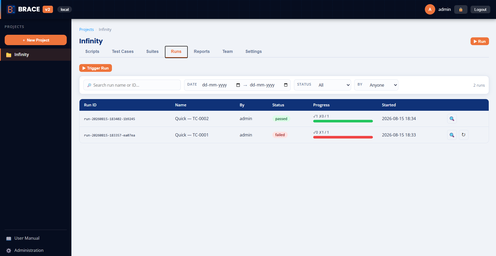
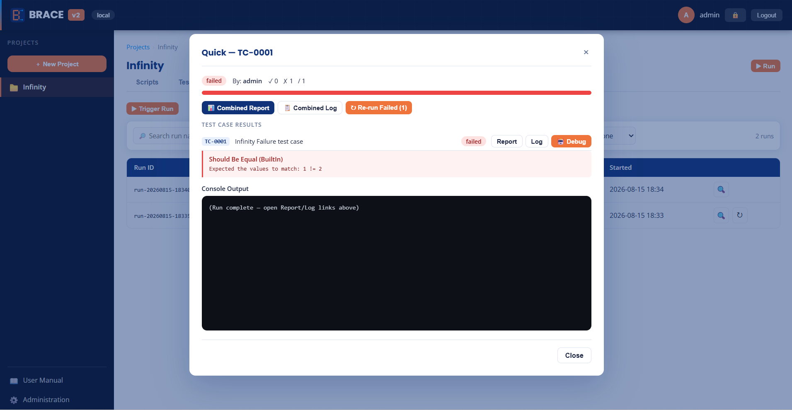
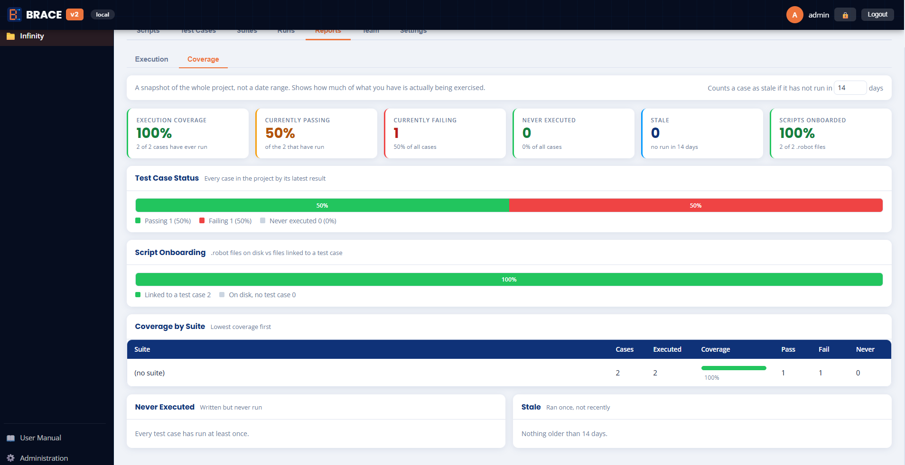
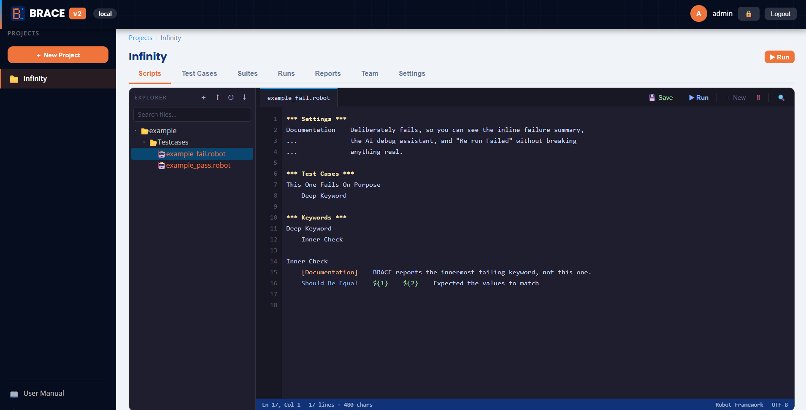

# BRACE

**B**usiness **R**obot **A**utomation **C**ontrol **E**ngine — a self-hosted test
management platform for [Robot Framework](https://robotframework.org).

Robot Framework runs tests. BRACE gives a team everything around them: projects,
test cases, suites, scheduled runs, parallel execution, reports, coverage
tracking, email alerts, and per-project access control — in one container, with
no external database.

Built for environments where a hosted SaaS is not an option, including
**air-gapped** networks: no CDN, no npm build step, no outbound calls at runtime.

[](LICENSE)

---

## Why

Teams running Robot Framework at any scale end up building the same things by
hand: a place to keep scripts, a way to run a subset, somewhere to see history,
and something that tells you when the nightly run broke. BRACE is that layer,
kept deliberately small — one process, one SQLite file, no broker, no queue, no
message bus to operate.

## What it does

- **Projects** with per-project roles — viewer, tester, project admin
- **Scripts** — a file explorer and editor over your `.robot` files, with Git sync
- **Test cases and suites** — name and group scripts; run a case, a suite, a
  selection, or everything carrying a tag
- **Parallel execution** with a global browser budget, so a 44-case suite finishes
  in minutes without OOM-killing the pod
- **Failure summaries inline** — the failing keyword, its message and the
  screenshot, extracted from `output.xml`, without opening `log.html`
- **Re-run only what failed** — 3 cases instead of 44
- **Scheduled runs** on cron, with a live preview of when they fire
- **Reports** — pass-rate trends, flaky detection, per-test-case history, and a
  coverage view answering "how much of our suite has ever actually run?"
- **Email notifications** with only-on-change suppression, so alerts stay readable
- **AI debug assistant** — optional; produces a copyable prompt when there is no
  outbound connectivity
- **Prometheus metrics** at `/metrics`

## Screens

<!-- Relative paths, so these render on GitHub, on GitLab and in an offline
     clone. Drop the PNGs into docs/images/ and they appear automatically.
     See docs/images/README.md for what to capture. -->

|  |  |
|---|---|
| <br>**Runs** — live progress, filter by name, date, status or who started it | <br>**Why it failed** — the failing keyword, Robot's message and the screenshot, without opening `log.html` |
| <br>**Coverage** — how much of the suite has ever actually run | <br>**Scripts** — file tree and editor, with Git sync |

---

## Quick start

Docker is the only prerequisite.

```bash
git clone <repo-url> && cd BRACE
docker compose -f docker-compose.local.yml up -d --build
```

Open <http://localhost:8080> and sign in as `admin` / `admin`. You will be asked
to change the password.

A small example project ships in `local_data/suites/example/` — one passing suite
and one that fails on purpose, so you can see failure summaries and re-run-failed
without writing anything first.

To start over completely:

```bash
docker compose -f docker-compose.local.yml down && rm -rf local_data/config
```

## Contents

- [Architecture](#architecture)
- [Deploying to Kubernetes](#deploying-to-kubernetes)
- [Configuration reference](#configuration-reference)
- [Sizing and concurrency](#sizing-and-concurrency)
- [Upgrading](#upgrading)
- [Operations](#operations)
- [Email notifications](#email-notifications)
- [Security](#security)
- [Troubleshooting](#troubleshooting)
- [Contributing](#contributing)

---

## Architecture

One pod, one process. No external database, no message broker, no cache.

```
┌──────────────────────── pod: brace-rf-controller ─────────────────────────┐
│                                                                            │
│  entrypoint-controller.sh                                                  │
│    ├── Xvfb :99                    virtual display for Chrome              │
│    └── uvicorn main:app --workers 1                                        │
│          ├── FastAPI + static SPA          :8080                           │
│          ├── APScheduler                   cron-triggered suite runs       │
│          └── asyncio executor  ──▶ python -m robot  ──▶ Chrome             │
│                                     (N in parallel, see Sizing)            │
│                                                                            │
│  /opt/rf/config   ← PVC   SQLite database (WAL)                            │
│  /opt/rf/suites   ← PVC   .robot scripts, git-synced                       │
│  /opt/rf/results  ← PVC   output.xml, log.html, report.html, screenshots   │
└────────────────────────────────────────────────────────────────────────────┘
```

**`--workers 1` is load-bearing.** Run state, the execution semaphores and the scheduler live in
process memory. A second worker would each keep its own copy, so the concurrency caps would be
silently doubled and queued runs would be invisible to the other worker. Scale by raising the
pod's CPU/memory and the concurrency settings, **not** by adding workers or replicas.

For the same reason the Deployment is `replicas: 1`. Two replicas would both mount the same
SQLite file and both run the scheduler — every scheduled suite would fire twice.

---

## Deploying to Kubernetes

Examples use `kubectl`. On OpenShift, `oc` is a drop-in replacement for every
command shown, and `k8s/deployment.yaml` includes a `Route` alongside the Service.

### 1. Build and push the image

```bash
VERSION=2.1.1
REGISTRY=registry.example.com/brace

docker build -f Dockerfile.optimized --build-arg APP_VERSION=$VERSION -t $REGISTRY/brace-runner-hardened:$VERSION .
docker push $REGISTRY/brace-runner-hardened:$VERSION
```

`APP_VERSION` stamps the image label **and** is passed to the app as `BRACE_VERSION`, so
`/health` reports the version of the image it is actually running. Pass the same value as the
tag; omit it and the build falls back to the `ARG APP_VERSION` default in the Dockerfile.

`Dockerfile.optimized` is the production build: a multi-stage UBI9 → **ubi9-micro** image with
Python, Robot Framework, and a pinned Chrome-for-Testing (`CFT_VERSION`, chrome and chromedriver
from the same release so they never drift). The final stage runs as UID 1001 with no shell
package manager, which is what keeps the CVE count low.

> **Always bump the tag.** `imagePullPolicy: Always` will re-pull a moved tag, but a reused tag
> makes "which build is actually running?" unanswerable. Confirm with `/api/health-detail`,
> which reports `image_tag`.

### 2. Create the Secret (once)

Nothing starts without it — deliberately, so the platform fails closed rather than falling back
to a default signing key.

```bash
./k8s/gen-secret.sh > /tmp/brace-secret.yaml
kubectl apply -f /tmp/brace-secret.yaml
shred -u /tmp/brace-secret.yaml
```

The script prints the generated **admin password to stderr — save it, it is stored nowhere else.**
It generates a random `JWT_SECRET` and a valid Fernet `BRACE_ENCRYPT_KEY`, and refuses to emit a
malformed encryption key. Pass `RMQ_PASSWORD=…` if you use the agent1 RCA listener.

To avoid writing secrets to disk at all, use the `oc create secret generic` form in
[`k8s/secret.template.yaml`](k8s/secret.template.yaml).

### 3. Apply the rest

```bash
kubectl apply -f k8s/supporting.yaml   # PVCs: suites 2Gi, results 2Gi, config 512Mi
kubectl apply -f k8s/deployment.yaml   # Deployment + Service + Route

# Optional — only if you run the agent1 RCA listener:
kubectl apply -f k8s/config.yaml       # ConfigMap: RabbitMQ settings
```

The Secret must exist first: `JWT_SECRET` and `BRACE_ENCRYPT_KEY` are declared as **required**
keys, so the pod will not start without them. Everything RabbitMQ-related is optional — the
controller never reads it, and the pod starts whether or not `brace-config` exists.

### 4. Verify

```bash
kubectl rollout status deployment/brace-rf-controller
kubectl get route brace-rf-dashboard -o jsonpath='{.spec.host}{"\n"}'
kubectl logs deployment/brace-rf-controller | head -30
```

A healthy start logs its effective configuration:

```
BRACE v2 started — env=staging tag=2.1.1 version=2.1.1 max_concurrent_runs=3
max_concurrent_tests=3 run_parallel=3 test_timeout=1800s scheduler_tz=Asia/Kolkata
container_tz=Asia/Kolkata local_time=2026-08-15 08:12:03
```

Check that line against what you intended — it is the fastest way to catch a config that did not
apply. In particular **`local_time` must match your own watch**: if it does not, `TZ` is wrong and
every timestamp in the UI will be offset by the same amount.

---

## Configuration reference

### Secret (`brace-secret`) — required

| Key | Purpose |
|---|---|
| `JWT_SECRET` | Signs login tokens. Anyone who knows it can forge a session as **any** user, including admin. 32+ random bytes. Rotating it logs everyone out. |
| `BRACE_ENCRYPT_KEY` | Fernet key encrypting git tokens, the AI API key and the SMTP password at rest. Must be url-safe base64 of exactly 32 bytes. **Rotating it makes existing git tokens undecryptable** — re-enter them per project afterwards. |
| `BRACE_ADMIN_PASSWORD` | Optional. Seeds the bootstrap `admin` password on a **fresh database only**. Omit and the account is created as `admin`/`admin` with a forced change at first login. |
| `RMQ_PASSWORD` | Optional. Only used by the agent1 RCA listener, which the controller does not run — omit it unless you deploy that listener. |

A malformed `BRACE_ENCRYPT_KEY` does not crash the pod — it logs `SECURITY: … will be stored in
PLAIN TEXT` and continues. Grep for that after any secret change.

### Environment (set in `k8s/deployment.yaml`)

| Variable | Default | Purpose |
|---|---|---|
| `BSS_ENV` | `staging` | Environment label. Values `local`/`dev`/`development` **bypass the startup security check** — never use them in a real deployment. |
| `IMAGE_TAG` | — | Reported by `/health`. Keep in step with the image tag so you can confirm what is live. |
| `CONFIG_DIR` | `/opt/rf/config` | SQLite database location. Must be a PVC. |
| `SUITES_DIR` | `/opt/rf/suites` | Script storage. Must be a PVC. |
| `RESULTS_DIR` | `/opt/rf/results` | Run artefacts. Must be a PVC; this is the one that fills. |
| `BRACE_MAX_CONCURRENT_RUNS` | `3` | Runs admitted at once. Extras queue. |
| `BRACE_MAX_CONCURRENT_TESTS` | = runs | **Total robot processes (browsers) across all runs.** The limit that must match pod resources. |
| `BRACE_RUN_PARALLEL` | = tests | Default cases one run may execute at once. Testers can lower it per run. |
| `BRACE_TEST_TIMEOUT_SEC` | `1800` | Per-test-case ceiling. A wedged browser is terminated so it cannot hold a slot forever. |
| `TZ` | container default (**UTC**) | The container's own clock. Timestamps are stored and displayed in this zone, so leaving it unset makes every time in the UI read hours behind for anyone not on UTC. Set it equal to `BRACE_SCHEDULER_TZ`. Requires `tzdata` in the image — it is. |
| `BRACE_SCHEDULER_TZ` | `UTC` | Timezone cron expressions are read in. **Set it** — left at UTC, `0 2 * * *` fires at 07:30 IST. |
| `BRACE_PUBLIC_URL` | — | External URL users browse to (the Route). **Notification emails cannot link back to a run without it.** Never the Service address. |
| `BRACE_LOG_FORMAT` | `text` | `json` emits one object per line with `run_id`/`project_id`/`user` for log indexing. |
| `BRACE_LOG_LEVEL` | `INFO` | Standard Python levels. |
| `STATIC_DIR` | derived | Only needed when running outside the container. |

---

## Sizing and concurrency

Test cases inside a run execute **in parallel**, so the number of runs no longer describes load —
the number of browsers does. Two independent limits:

- `BRACE_MAX_CONCURRENT_RUNS` — queueing fairness. Cheap; tune freely.
- `BRACE_MAX_CONCURRENT_TESTS` — **physical.** Every unit is a Chrome + chromedriver + robot
  process. Exceed what the pod can hold and it is OOM-killed, losing every in-flight run rather
  than just the excess.

| Pod resources | `MAX_CONCURRENT_TESTS` | `/dev/shm` |
|---|---|---|
| 2 CPU / 4 Gi | 3 *(current)* | 512 Mi |
| 4 CPU / 8 Gi | 6 | 1 Gi |
| 8 CPU / 16 Gi | 12 | 2 Gi |

Raise the env var and `resources.limits` **together, in the same change**. Chrome also needs
shared memory: past roughly 6 concurrent browsers, raise the `dshm` volume's `sizeLimit` too, or
Chrome crashes in confusing ways rather than failing cleanly.

Rough throughput: a test case averages ~78 s in this deployment, so a 44-case suite takes about
57 minutes serially and ~19 minutes at 3-wide.

Runs beyond capacity sit at `queued` and start automatically. If the pod restarts, runs left
`queued` or `running` are marked `cancelled` at startup rather than being stranded.

---

## Upgrading

```bash
# 1. build and push a NEW tag
docker build -f Dockerfile.optimized --build-arg APP_VERSION=2.1.1 -t <registry>/brace-runner-hardened:2.1.1 .
docker push <registry>/brace-runner-hardened:2.1.1

# 2. update BOTH the image and IMAGE_TAG in k8s/deployment.yaml, then
kubectl apply -f k8s/deployment.yaml
kubectl rollout status deployment/brace-rf-controller
```

Database migrations run automatically at startup — new columns are added idempotently, and no
manual step is needed. Migrations are additive only; **there is no downgrade path**, so roll back
by redeploying the previous image tag and accepting that newer columns are simply unused.

Frontend changes require a rebuild. `COPY controller/` bakes the SPA into the image; there is no
volume mount for it.

### Rollback

```bash
kubectl rollout undo deployment/brace-rf-controller
```

PVC data is untouched by a rollback.

---

## Operations

### Health and metrics

| Endpoint | Auth | Use |
|---|---|---|
| `/health` | none | Liveness/readiness probe. Reports `image_tag`. |
| `/metrics` | none | Prometheus scrape. Already annotated in the Deployment. |
| `/api/health-detail` | system admin | Live limits, tests running now, deployed image tag. |
| `/api/admin/scheduler-jobs` | system admin | What the scheduler actually holds and when each job next fires. |

Metrics worth alerting on:

| Metric | Why |
|---|---|
| `brace_results_disk_bytes` | **The most important one.** A full results PVC stops every run. |
| `brace_runs_queued` | Sustained backlog means the pod is undersized. |
| `brace_test_slots_available` | Pinned at 0 for long periods: same conclusion. |
| `brace_tests_total{outcome="timeout"}` | Rising = wedged browsers, or a timeout set too low. |

### Disk

Results grow at roughly **13 MB per run**. On a 2 Gi PVC that is ~150 runs. Two ways to reclaim:

- **Settings → Danger Zone → Old runs only** keeps the 10 most recent (per project, manual).
- Raise the PVC size in `k8s/supporting.yaml` if your storage class allows expansion.

There is no automatic retention. Alert on `brace_results_disk_bytes` and prune deliberately.

### Backup

Everything that matters is on three PVCs. The database is the one that cannot be recreated:

```bash
kubectl exec deployment/brace-rf-controller -- \
  python -c "import sqlite3;src=sqlite3.connect('/opt/rf/config/brace.db');dst=sqlite3.connect('/tmp/backup.db');src.backup(dst)"
kubectl cp brace-rf-controller-<pod>:/tmp/backup.db ./brace-backup-$(date +%F).db
```

Use SQLite's `.backup` as above rather than copying `brace.db` directly — the database runs in WAL
mode, so a plain file copy can miss committed transactions still in the WAL.

Scripts are reproducible from git; results are disposable.

---

## Email notifications

One SMTP account server-wide (Administration → Email Notifications); each project then chooses
what it sends (Settings → Notifications). Sending is in-process via stdlib `smtplib` — **no
broker, no sidecar, no extra Deployment**.

### What must be reachable

The pod needs egress to your SMTP server. That is the only new infrastructure dependency.

| Requirement | Detail |
|---|---|
| **Egress to the relay** | Port 587 (STARTTLS) or 465 (SSL). If the namespace has a default-deny egress NetworkPolicy this must be allowed — the most common silent failure. |
| **DNS** | This Deployment resolves most hosts via `hostAliases`. A public relay such as `smtp.gmail.com` needs working cluster DNS **and internet egress**. |
| **Approved sender** | Most relays reject a `From` they do not recognise; it usually must match the login account. |
| **Credentials** | App Password for Gmail/Outlook/Yahoo; SMTP AUTH enabled for M365; or an IP-allowlisted internal relay with no auth at all. |

Presets are built in for Gmail/Google Workspace, Microsoft 365, Outlook, Yahoo, Zoho, SendGrid,
Amazon SES, and a no-auth internal relay.

> **Gmail and Google Workspace require a 16-character App Password**, not the account password —
> that is always rejected. Enable 2-Step Verification, then create one under
> *myaccount.google.com → Security → App passwords*.

> **Air-gapped clusters:** `smtp.gmail.com` is on the public internet. If this namespace has no
> outbound internet route, use an internal relay instead — and note that emails carry test names
> and failure messages, so a public provider means those details leave your network.

### Behaviour worth knowing

- **One email per run**, never one per failed case. A 44-case suite failing sends one message.
- **Only-on-change is on by default.** A suite failing nightly for three weeks emails once, when
  it *starts* failing — not 21 times. Each suite is tracked separately.
- **Mail failure never affects a run.** Sending happens after the run is committed, in the
  background, with one retry; a dead relay is logged and nothing else.
- The **weekly digest** reuses the Coverage figures and runs off the same scheduler.

`BRACE_PUBLIC_URL` must be set for the "open the run" link to work.

### Verifying

Administration → Email Notifications → **Send Test**. It makes a real connection and reports the
actual error, so a wrong App Password is distinguishable from a blocked port. Common ones:

| Symptom | Cause |
|---|---|
| `Authentication failed … App Password` | Gmail/Workspace account password used instead of an App Password, or 2FA off. M365: SMTP AUTH not enabled for the mailbox. |
| `Connection timed out` | Egress blocked, or the host does not resolve from inside the cluster. |
| `The server rejected the From address` | Sender not allowlisted by the relay. |
| `TLS handshake failed` | Self-signed internal relay — untick *Verify TLS certificate*. |

---

## Security

The controller **refuses to start** in a non-local environment if `JWT_SECRET` is still the
built-in default. Warnings (not fatal) are logged for a short secret, a missing encryption key,
and an admin account still on its initial password.

Enforced in the deployment:

- Runs as UID 1001, `runAsNonRoot`, `allowPrivilegeEscalation: false`, all capabilities dropped,
  `seccompProfile: RuntimeDefault`.
- TLS terminates at the Route (`edge`, HTTP redirected).
- Path traversal is blocked on every filesystem endpoint by resolving and containment-checking
  against the project directory.
- Project membership is checked per request; cross-project IDs are rejected rather than trusted.
- Git tokens, the AI API key and the SMTP password are encrypted at rest and never returned to the browser. Git
  credentials are masked in sync logs.

Scan-related config lives in `.trivyignore` and `.grype.yaml`.

> **The AI Debug Assistant sends test source and logs to whichever endpoint is configured.** On an
> air-gapped deployment leave in-app analysis disabled — users still get the **Copy Prompt**
> option, which produces a self-contained prompt to paste into an AI tool on their own machine.

---

## Troubleshooting

**Pod will not start; logs say `Refusing to start with insecure defaults`**
`JWT_SECRET` is unset or still the default. The `brace-secret` is missing or misnamed. This is
intentional — do not work around it with `BSS_ENV=local`.

**`SECURITY: BRACE_ENCRYPT_KEY is set but invalid`**
The key is not url-safe base64 of exactly 32 bytes. Secrets are being stored in **plain text**.
Regenerate with `gen-secret.sh` and re-enter each project's git token.

**Chrome fails with `session not created`**
Xvfb did not start. Check the startup log for `Starting Xvfb on :99`. If tests fail only under
load, it is more likely `/dev/shm` exhaustion — see [Sizing](#sizing-and-concurrency).

**Runs stuck at `queued`**
Capacity is full; they start on their own. If a run has been executing far longer than a test
should take, cancel it to release its slot. Confirm with `brace_test_slots_available`.

**Scheduled runs never execute**
Check the schedule is enabled and the suite is not empty, then `/api/admin/scheduler-jobs` for the
real next-fire time. Most often it is the timezone: cron is read in `BRACE_SCHEDULER_TZ`.

**Frontend changes are not visible**
The SPA is baked into the image. Rebuild and bump the tag; a `rollout restart` on the same tag
changes nothing.

**Times in the UI are hours out from my watch**

`TZ` is unset or wrong, so the container runs in UTC while you read the page in your own zone.
Check the startup log — it prints `container_tz=` and `local_time=`; if that time is not the time
where you are, that is the cause. Set `TZ` (same value as `BRACE_SCHEDULER_TZ`) and redeploy.

Timestamps already written keep the old zone. To shift existing history from UTC to IST, **back up
the database first**, then:

```bash
kubectl exec deployment/brace-rf-controller -- python -c "
import sqlite3; c=sqlite3.connect('/opt/rf/config/brace.db')
for t,cols in [('test_runs',['started_at','finished_at']),('test_run_items',['started_at','finished_at']),('test_cases',['last_run_at'])]:
    for col in cols:
        c.execute(f\"UPDATE {t} SET {col}=strftime('%Y-%m-%dT%H:%M:%S',{col},'+5 hours','+30 minutes') WHERE {col} IS NOT NULL AND {col}!=''\")
c.commit(); print('shifted')"
```

Each modifier must be a **separate** argument — `'+5 hours 30 minutes'` as one string is invalid
and SQLite silently writes NULL over every timestamp. Adjust the offset for your zone, and run it
once only: it is not idempotent.

**Everything failed at once after a restart**
Expected. In-flight runs are marked `cancelled` at startup rather than left stranded. Re-run them.

**Results PVC full**
Runs fail to write artefacts. Prune via Danger Zone or expand the PVC, then alert on
`brace_results_disk_bytes` so it does not recur.

---

## Repository layout

```
controller/              FastAPI backend + SPA
  main.py                API, execution engine, security
  db.py                  SQLite schema and idempotent migrations
  scheduler.py           APScheduler wrapper, cron parsing
  mailer.py              SMTP transport, provider presets, email templates
  static/                index.html + css/ + js/ (no build step)
k8s/
  deployment.yaml        Deployment + Service + Route
  supporting.yaml        PersistentVolumeClaims
  config.yaml            ConfigMap (RabbitMQ, agent1 only)
  secret.template.yaml   Secret template — never commit a filled copy
  gen-secret.sh          Generates a ready-to-apply Secret
Dockerfile.optimized     Production build (UBI9 → ubi9-micro)
entrypoint-controller.sh Xvfb + uvicorn
docker-compose.local.yml Local development stack
requirements_optimized.txt
```

In-app documentation for testers lives under **📖 User Manual** in the sidebar — features,
workflows and troubleshooting from a user's perspective, rather than a deployer's.

---

## Contributing

Contributions are very welcome — see [CONTRIBUTING.md](CONTRIBUTING.md) for how
to run it locally and the few architectural constraints worth knowing before you
write code (no build step, no new runtime dependencies, single worker).

- [Code of Conduct](CODE_OF_CONDUCT.md)
- [Security policy](SECURITY.md) — please report vulnerabilities privately

Good first issues: screenshots for this README, a test suite, and
`docker-compose` support for ARM.

## Licence

[Apache-2.0](LICENSE).
